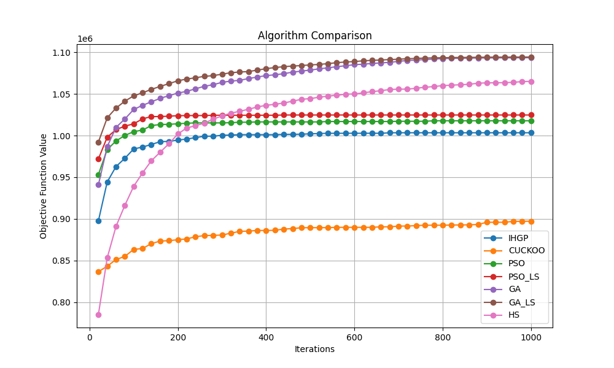

# Heuristic Optimization Algorithms

This project implements and compares various heuristic optimization algorithms, including **Genetic Algorithms (GA)**, **Particle Swarm Optimization (PSO)**, and their variations with local search, to solve complex optimization problems.

## Table of Contents
- [Features](#features)
- [Project Structure](#project-structure)
- [Dependencies](#dependencies)
- [Setup](#setup)
- [Usage](#usage)
- [Results](#results)
- [Contributing](#contributing)
- [License](#license)

---

## Features
- **Optimization Algorithms**: Includes implementations for:
  - Genetic Algorithm (GA)
  - Genetic Algorithm with Local Search (GA_LS)
  - Particle Swarm Optimization (PSO)
  - Particle Swarm Optimization with Local Search (PSO_LS)
- **Problem Selection**: Dynamically select optimization problems to solve.
- **Result Analysis**: Compare algorithm performance using:
  - Best solution
  - Mean and standard deviation across multiple runs
- **Visualization**: Graphically compare algorithm performance.
- **Result Saving**: Automatically saves outputs for analysis.

---

## Project Structure
```plaintext
.
├── heuristic
│   ├── algorithms                  # Contains algorithm implementations
│   ├── problems                    # Problem definitions
│   └── utils                       # Utility functions
├── main.py                         # Entry point for running algorithms
├── README.md                       # Project documentation
├── requirements.txt                # Dependencies
├── results                         # Stores outputs and plots
├── .gitignore                      # Git ignore rules
└── .venv                           # Virtual environment (not included in repo)
```

---

## Dependencies
- Python 3.10 or higher
- Required libraries are listed in `requirements.txt`.

Key dependencies:
- `numpy`
- `matplotlib`

Install them using:
```bash
pip install -r requirements.txt
```

---

## Setup

1. **Clone the repository**:
   ```bash
   git clone https://github.com/Ibrahimghali/heuristic.git
   cd heuristic-optimization
   ```

2. **Create a virtual environment**:
   ```bash
   python -m venv .venv
   source .venv/bin/activate  # On Windows: .venv\Scripts\activate
   ```

3. **Install dependencies**:
   ```bash
   pip install -r requirements.txt
   ```

---

## Usage

1. **Run the main script**:
   ```bash
   python main.py
   ```

2. **Select a problem**: Follow the prompts to select an optimization problem to solve.

3. **View Results**:
   - Best, mean, and standard deviation of solutions will be printed in the terminal.
   - Output files will be saved in the `results/` directory.

4. **Visualize Results**:
   - Plots will be displayed and saved in `results/plots`.

---

## Results

- **Text Results**: 
  Outputs for all algorithms are saved in `results/` with filenames corresponding to the algorithm names.
  
- **Plots**: 
  Comparative performance plots are saved in `results/plots`.

Example result plot:



---

## Contributing

We welcome contributions! To contribute:
1. Fork the repository.
2. Create a feature branch (`git checkout -b feature-name`).
3. Commit your changes (`git commit -m "Add feature-name"`).
4. Push to your fork (`git push origin feature-name`).
5. Open a pull request.

---

## License

This project is licensed under the MIT License. See `LICENSE` for details.

---
